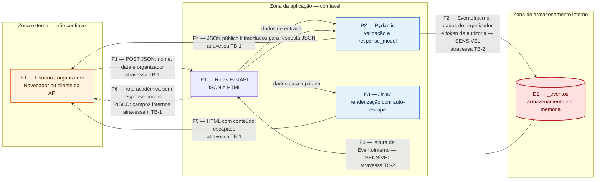

# DFD — Eventos API

Este diagrama representa o fluxo de dados atual da aplicação. As linhas `TB-1` e `TB-2` são fronteiras de confiança: sempre que um fluxo as atravessa, os dados devem ser validados, filtrados ou protegidos conforme sua sensibilidade.

## Fronteiras de confiança

- **TB-1 — Cliente ↔ aplicação:** separa o navegador ou cliente da API, que não é confiável, do processo FastAPI. A entrada precisa ser validada pelo Pydantic; na saída, o `response_model` filtra o JSON e o Jinja2 escapa conteúdo inserido no HTML.
- **TB-2 — aplicação ↔ armazenamento:** separa logicamente o processamento HTTP da camada de dados. No protótipo, o armazenamento está no mesmo processo, mas o limite continua relevante porque a aplicação grava e recupera objetos que contêm campos internos.

## Fluxos sensíveis

O fluxo **F2** leva `organizador`, `organizador_id` e `token_auditoria` ao armazenamento, atravessando a TB-2. O fluxo **F3** devolve esse objeto interno para processamento. Antes de qualquer saída pela TB-1, o fluxo normal passa pelo `EventoPublico`, que remove `organizador_id` e `token_auditoria`. O fluxo demonstrativo **F6** evidencia a falha: sem `response_model`, esses campos internos cruzam a fronteira externa e chegam ao cliente.

## Legenda

- `E1`: entidade externa;
- `P1` a `P3`: processos;
- `D1`: armazenamento de dados;
- `F1` a `F6`: fluxos de dados;
- seta tracejada: fluxo deliberadamente inseguro mantido apenas para demonstração acadêmica.
